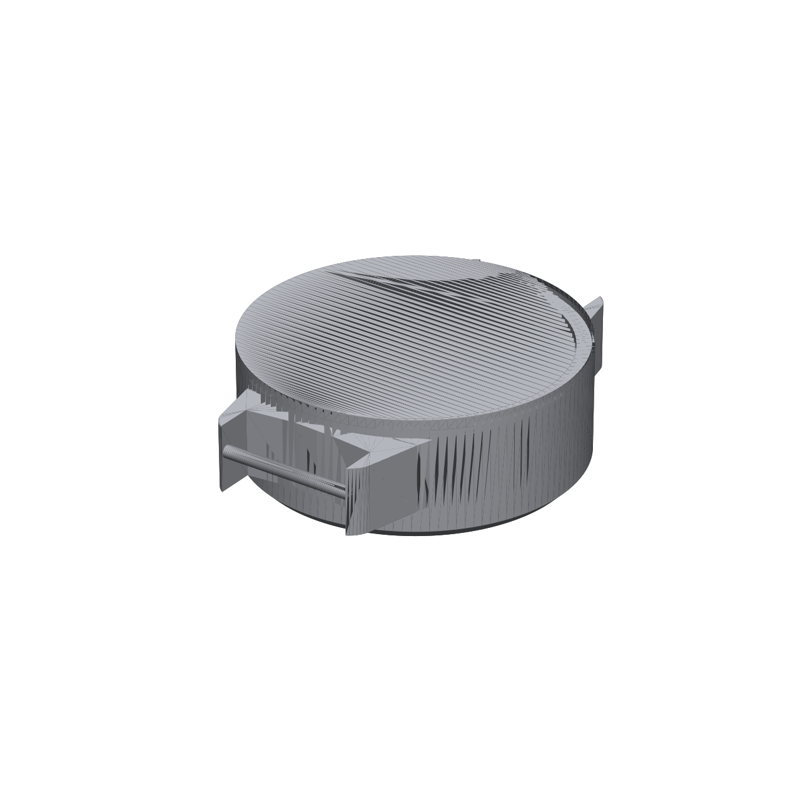
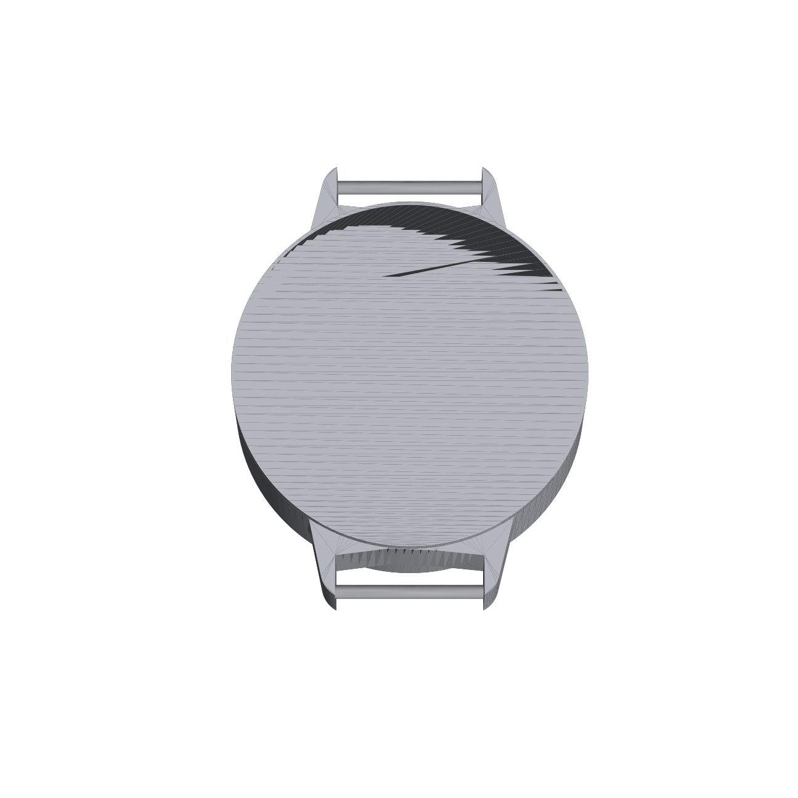
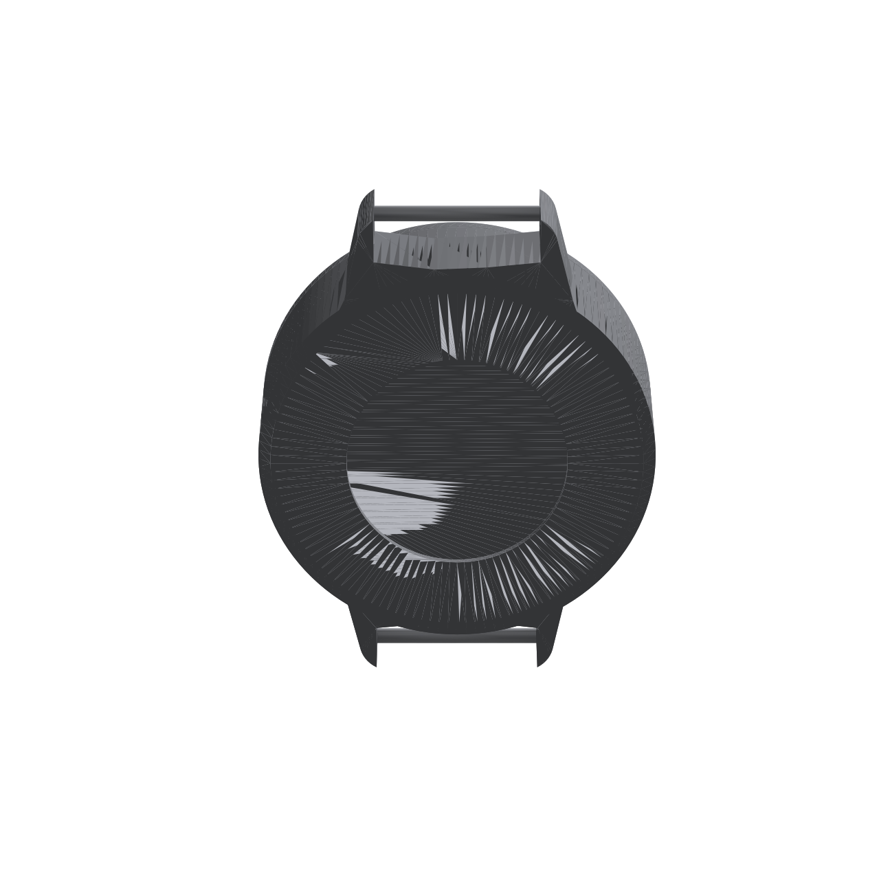
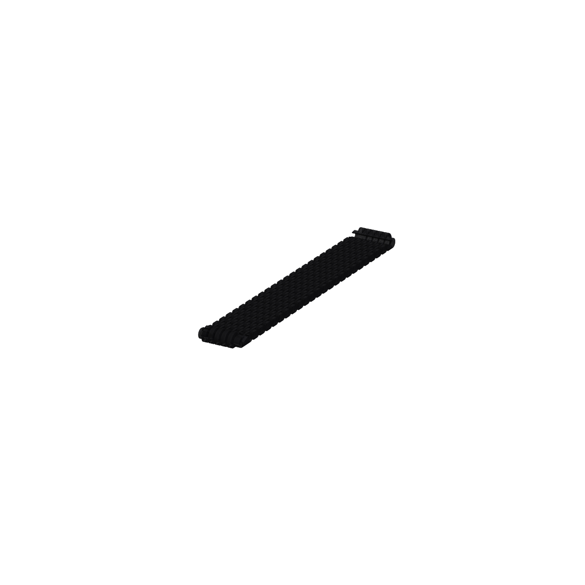
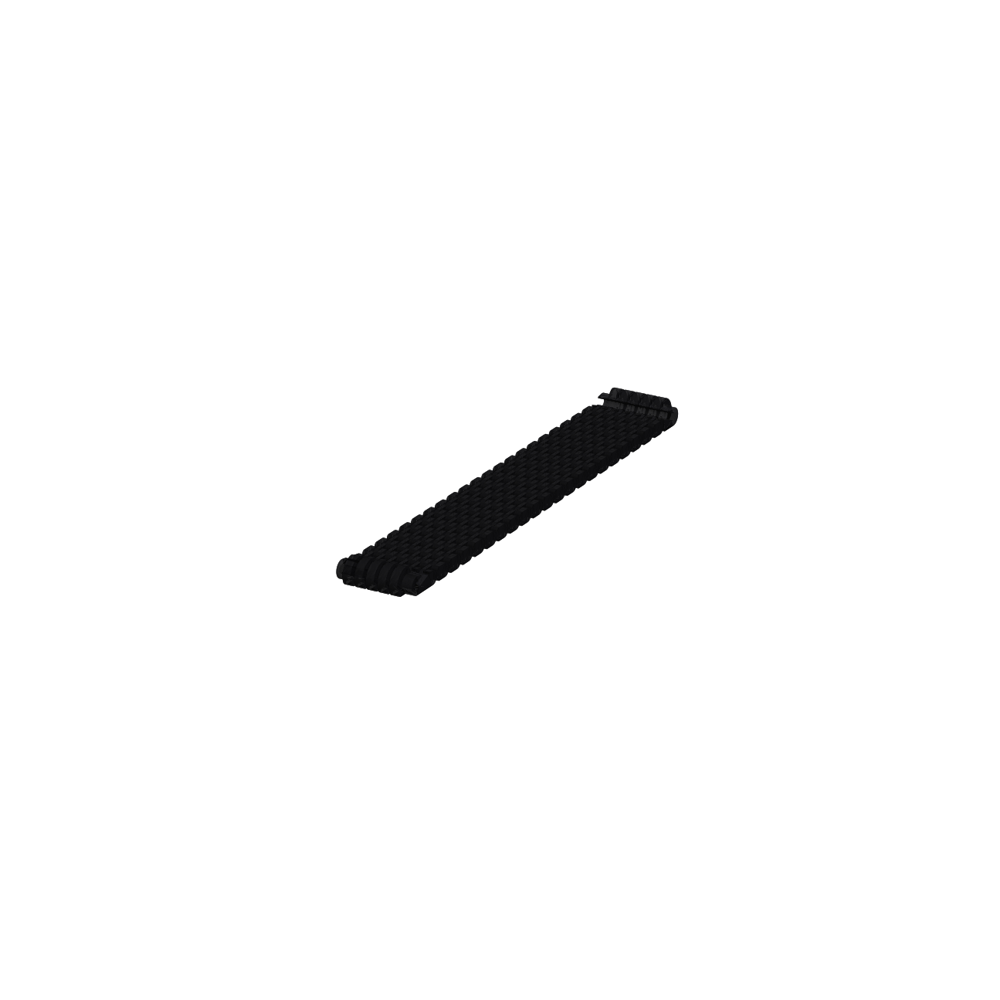

# 3D-Printed Case & Strap

Printable enclosure and wristband for the ESP32-C3 SmartWatch build.

| File | Description | Approx. size (W × L × H, mm) |
|---|---|---|
| [`watchcase_new.3mf`](watchcase_new.3mf) | Watch case assembly — main shell, bezel, and strap lugs | 64 × 80 × 24 |
| [`prizma_wristband_144mm_plus4links.stl`](prizma_wristband_144mm_plus4links.stl) | Modular link wristband, 144mm base + 4 extra links (larger wrist) | 26 × 183 × 8.3 |
| [`prizma_wristband_144mm_plus2links.stl`](prizma_wristband_144mm_plus2links.stl) | Modular link wristband, 144mm base + 2 extra links (smaller wrist) | 26 × 169 × 8.3 |

Dimensions above are bounding-box measurements taken directly from the model files — treat them as a sanity check for build-plate/bed size, not a substitute for checking the actual model in your slicer.

## Case

  

Houses the ESP32-C3 Super Mini, GC9A01 round display, MAX30102, and MPU6050 as a single wrist-worn unit. `watchcase_new.3mf` contains the full multi-body assembly (shell + bezel + button/lug details) with parts already positioned — most slicers will preserve the layout on import.

## Wristband

 

Modular, link-style band that attaches to the case lugs. Two link-count variants are provided so you can pick the closer fit for your wrist size, rather than needing a separate buckle/adjustment mechanism.

## Notes

- Renders above are auto-generated flat-shaded previews for a quick visual reference — they're not a substitute for opening the files in your slicer to check wall thickness, supports, and orientation.
- Recommended print settings (material, layer height, infill, supports) aren't documented yet — add them here once you've dialed in your printer profile.
